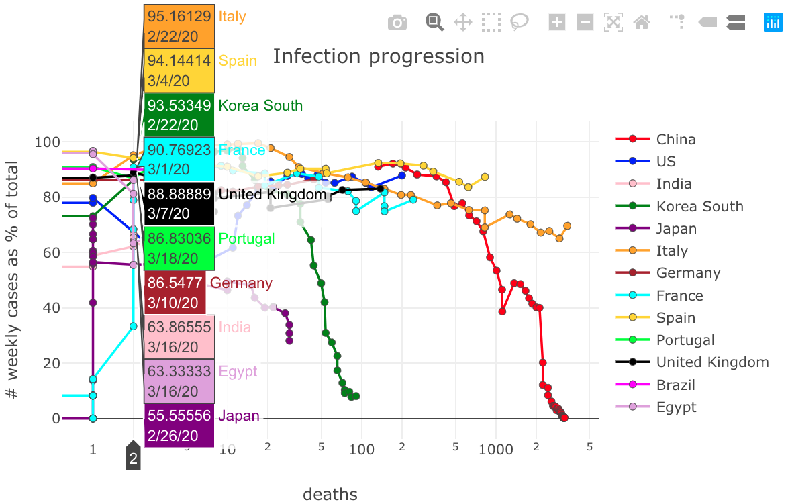
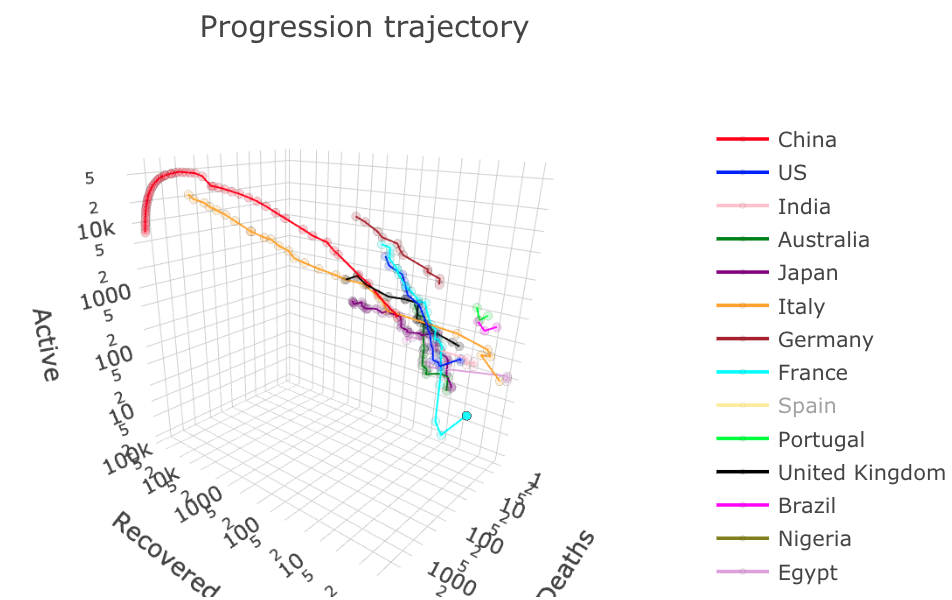
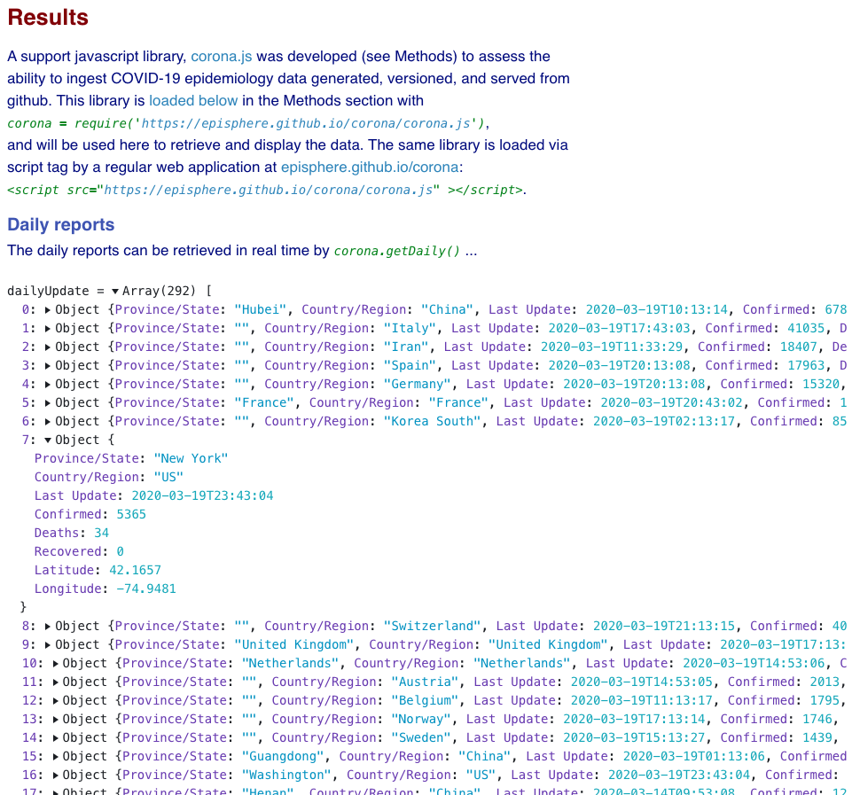

# corona

Exploring realtime interoperability with COVID-19 data. The use of corona.js library is illustrated by a web page at https://episphere.github.io/corona, and an observable notebook at <a href="https://observablehq.com/@episphere/corona" target="_blank">observablehq.com/@episphere/corona</a>:

